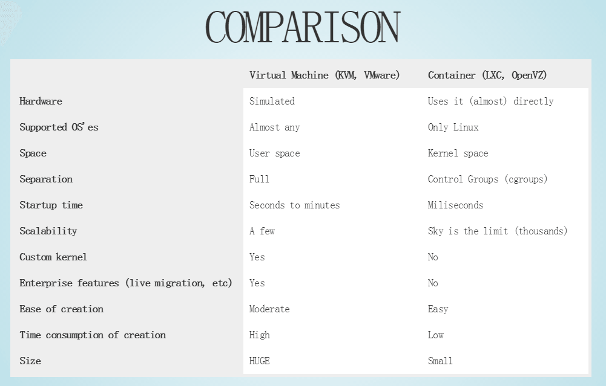

# docker是什么

它利用了虚拟化技术作为底层，最大程度压榨系统资源，使其充分利用，跟vmware类似，但又有着不一样的设计。

引用 segmentfault 上一位网友 widuu 的回答

> docker做到了PAAS即平台即服务，docker在64位linux上使用的是lxc内核虚拟化也就是轻量级的虚拟化，与VM相比不需要对硬件进行仿真就可以共享跟主机一样的操作系统，并且有AUFS和lXC来虚拟化，加入一个ubuntu的镜像是265MB，你要再VM主机新建1000个就需要265000MB内存，但是docker共享容量也就需需要256多一点，如果你在linux上跑VMware相信你会看主机内存的消耗是比较大的，一个亚马逊EC2 512MB内存单核的云主机开5个docker无压力，你要是跑5个vmware那可费劲了

这里有个更详细的比较

[这篇文章](http://tiewei.github.io/cloud/Docker-Getting-Start/) 详细介绍了docker的一些细节，感兴趣的同学可以看一下。

